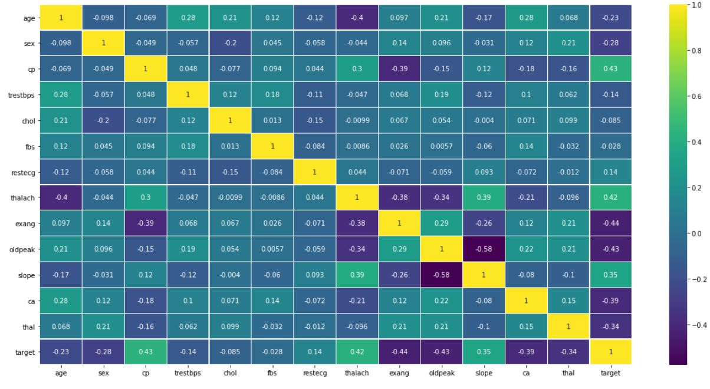
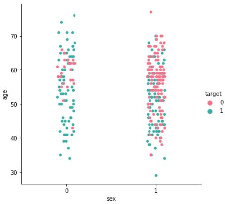
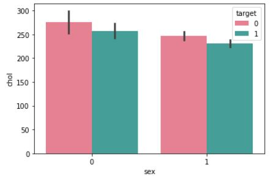
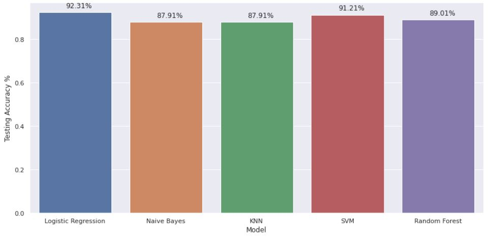
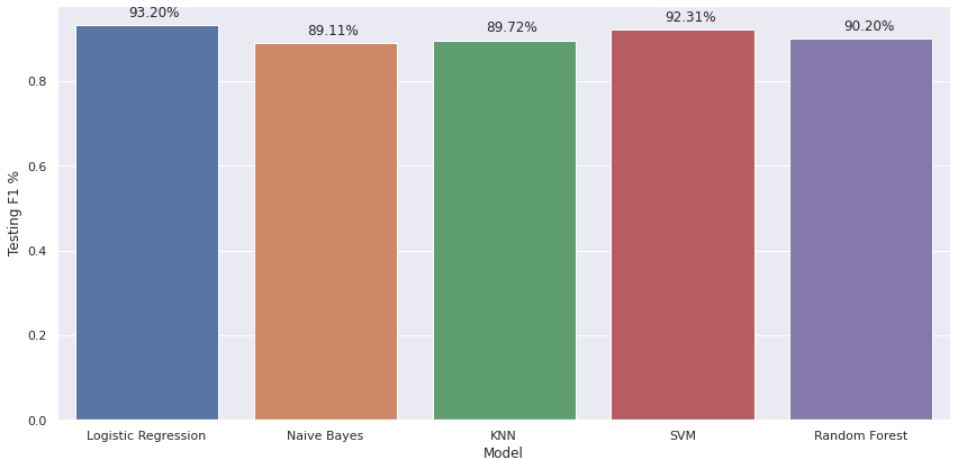

# Classifiaction-CapStone

## Overview

Analysis for a popular dataset on Kaggle is the [Heart Disease UCI](https://www.kaggle.com/ronitf/heart-disease-uci) dataset, by doing some features correlations, in addition ti going through some quick plot visualizations, analyzing them and getting some conclusions. And then will proceed to apply several ML models to see which yields better results and finishing with Classifier models

---

### Data description:

- age - age in years
- sex - (1 = male; 0 = female)
- cp - chest pain type
  - Value 1: typical angina
  - Value 2: atypical angina
  - Value 3: non-anginal pain
  - Value 4: asymptomatic
- trestbps - resting blood pressure (in mm Hg on admission to the hospital)
- chol - serum cholestoral in mg/dl
- fbs - (fasting blood sugar > 120 mg/dl) (1 = true; 0 = false)
- restecg - resting electrocardiographic results
- thalach - maximum heart rate achieved
- exang - exercise induced angina (1 = yes; 0 = no)
- oldpeak - ST depression induced by exercise relative to rest
- slope - the slope of the peak exercise ST segment
  - Value 1: upsloping
  - Value 2: flat
  - Value 3: downsloping
- ca - number of major vessels (0-3) colored by flourosopy
- thal - 3 = normal; 6 = fixed defect; 7 = reversable defect
- target - have disease or not (1=yes, 0=no)

---

## Data Analysis

### Data Correlation

### Correlation analysis

- What I can conclude is that most correlated features (from the 14 features used including the 'target' column) are:

  - **cp** - **target** (Positive Correlation)
  - **thalach** - **target** (Positive Correlation)
  - **thalach** - **slope** (Positive Correlation)
  - **age** - **target** (Negative Correlation)
  - **sex** - **target** (Negative Correlation)
  - **exang** - **target** (Negative Correlation)
  - **oldpeak** - **target** (Negative Correlation)
  - **ca** - **target** (Negative Correlation)
  - **thal** - **target** (Negative Correlation)

### Analyzing and plotting some visualizations of those correlated features

| Age Correlated with Sex      | Serum Cholestoral Correlated with Sex |
| ---------------------------- | ------------------------------------- |
|  |           |

### Build Classification Models

apply several ML models to see which yields better results and finishing with a basic Classifier model:

- ##### Logistic Regression
- ##### KNN Classifier
- ##### Decision Tree
- ##### Random Forest Classifier
- ##### Support Vector Machine (SVM)
- ##### Naive Bayes

## Conclusion

| Accuracy for Test Data       | F1 for Test Data             |
| ---------------------------- | ---------------------------- |
|  |  |

- Logistic Regression and SVM got the highest accuracy and F1 for test data

- Naive Bayes Model got the lowest accuracy and F1 for test data

---

## Source

Heart Disease UCI Dataset: https://www.kaggle.com/ronitf/heart-disease-uci
